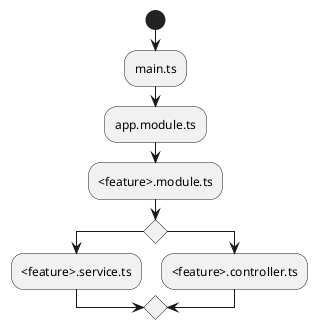

# Try-NestJS

## How to install

```shell
yarn global add @nestjs/cl
```

## What's NestJS

- Node.jsで動作するOSSバックエンド開発フレームワーク(TS製)
- Expressをコア&Angularインスパイア
- NestCLIを提供

  ```shell
  nest new <name>
  nest g controller <name>
  ```



### Module

- 関連するController, ServiceなどをまとめNestJSに登録する
- Moduleを追加していくことで利用可能な機能を増やす
- classに対して、`@Module()`デコレータをつける

  ```typescript
  @Module({
    imports: [FugaModule], // モジュール内部で必要な外部モジュールを記述: DBを扱うためのモジュールなど
    controllers: [HogeController], // @Controllerデコレータが付いたクラス: コントローラを用意する
    providers: [HogeService], // @Injectableデコレータが付いたクラス: DIしたいクラスを定義, ServiceなどがをDI
    exports: [HogeService], // importsまたはprovidersの中で外部にエクスポートしたいもの: 複数のモジュールで横断的に利用したいもの
  })
  export class HogeModule{}
  ```

- cliコマンド

  ```shell
  nest g module <name>
  ```

### Controller

- ルーティング機能
  - クライアントからのリクエストを受け取り、レスポンスを返す
- 特定のパスとControllerが紐づけられる
  - `/auth`のパスは`AuthController`と紐づける
    - ex) AuthController.controller.ts

    ```typescript
    import { controller } from '@nestjs/common'

    @Controller('auth')
    export class AuthController {
      @Post
      signup() {

      }
    }
    ```

  - cliコマンド

    ```shell
    # テストあり
    $ nest g controller <name>
    # テストなし
    $ nest g controller <name> --no-spec
    ```

### Service

- ビジネスロジックを書く
- Controllerから呼び出し、ユースケース層として利用
  - DIコンテナによる依存性の注入が可能
    - @Injectable() デコレータを利用し、Moduleのprovidersプロパティに設定するだけ
      ex) hoge.service.ts

      ```typescript
      import { Injectable } from '@nestjs/common';

      @Injectable()
      export class HogeService {
        something(name: string) {

        } 
      }
      ```

      ex) hoge.module.ts

      ```typescript
      @Module({
        controllers: [HogeController],
        providers: [HogeService],
      })
      export class HogeModule {}
      ```

    - 利用する際はconstructorでServiceを受け取る
      ex) hoge.controller.ts

      ```typescript
      @Controller('hoge')
      export class HogeController {
        constructor(private readonly hogeService: HogeService) {}

        @Get(':name')
        something(@Param('name') something: string) {
          this.hogeService.something(name);
        }
      }
      ```

### Pipe

- ハンドラーがリクエストを受け取る前に処理を行う
  - バリデーションなどを実行可能
    - ValidationPipe: バリデーション
    - ParseIntPipe: 入力を整数型に変換
    - ParseBoolPipe: 入力をBoolean型に変換
    - ParseUUIDPipe: 入力をUUID型に変換
    - DefaultValuePipe: 入力がnull, undefinedの場合にデフォルト値を設定
- データの変換&バリデーションが可能

  ```typescript
  @Post()
  something(
    @Body('id', ParseUUIDPipe) id: string,
  ) {
    this.hogeService.something(id);
  }
  ```

### TypeORM

- @Entityデコレータをつけたクラスとして定義
- カラムは@PrimaryGeneratedColumnや@Columnデコレータをつけることでマッピング可能

  ```typescript
  @Entity()
  export class User {
    @PrimaryGeneratedColumn('uuid')
    id: string

    @Column()
    name: string
  }
  ```

- Entityを管理するためにRepositoryオブジェクトを定義する
- クラスに@EntityRepository()デコレータをつけ、Repositoryを継承して定義

  ```typescript
  @EntityRepository(User)
  export class UserRepository extends Repository<User> {
    findById(id: string) {
      return this.findById(id);
    }
  }
  ```

## How to start

```shell
nest new sample
cd sample
// yarnを選択
yarn start:dev
```

## 参考資料

- [How To Use Prisma with PostgreSQL, SQLite, and MySQL](https://codevoweb.com/how-to-use-prisma-with-postgresql-sqlite-and-mysql/)
- [TypeORM 0.3系のマイグレーション](https://qiita.com/Aurum64/items/f5962bd2a643447dbef9)
- [NestJS: TheComplete Developer's Guide](https://www.udemy.com/course/nestjs-the-complete-developers-guide/)
